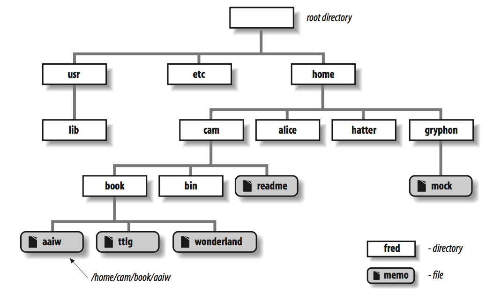
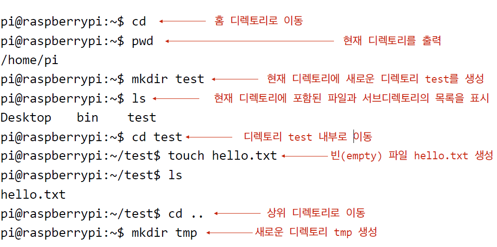
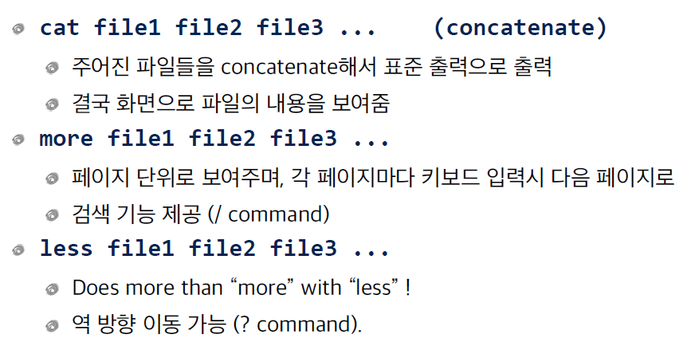
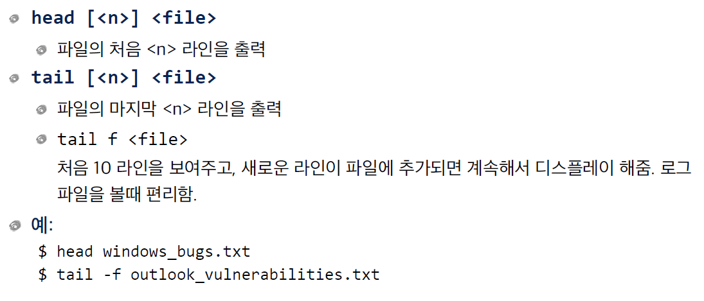
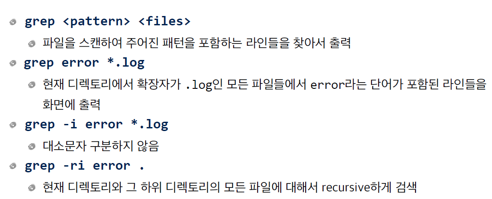

# 임베디드 시스템 프로그래밍 1장

[TOC]

## 라즈베리파이,리눅스,파이썬

1. ## Raspnerry Pi 기능 및 용도 + 원격접속 방법

2. ## Linux 소개

   1. Linux는 다중 사용자 운영체제 각각의 사용자는 유일한 username을 가진다.

   2. superuser라고 불리는 특권을 가진 사용자: root

   3. superuser는 시스템의 거의 모든 자원에 대한권한을 가진다.

      - superuser 권한 획득하기

        주로 sudo 명령을 사용하는 것을 권장한다.
   
3. ## 파일 시스템 사용

4. 

- 루트 디렉토리 
  - 최상위 디렉토리로 / 로 표시
- 절대 경로
  - /home/cam/book/wonderland
- 현재 디렉토리와 상대경로
  - 사용자가 현재 위치한 디렉토리(pwd명령 )

5. ## 홈 디렉토리

   - 각각의 사용자에게 할당된 디렉토리
   - Debian/Ubuntu 등에서는 "/home/username"
   - 자신의 홈 디렉토리 찾기/이동하기
     - $ cd
       - 매개변수 없는 cd 명령은 자신의 홈 디렉토리로 이동
       - HOME 환경 변수는 자신의 홈 디렉토리 이름을 값으로 가짐
       - ex) $ echo $HOME
     - ~
       - 디렉토리명이 들어갈 자리에 있는 ~는 자신의 홈 디렉토리 명으로 대체
     - echo 명령은 입력된 값을 **그대로 ** 화면에 출력
     - .
       - 항상 현재 디렉토리를 나타냄
       - ./readme.txt 와 readme.txt 는 동일
     - ..
       - 현재 디렉토리의 부모디렉토리
       - cd ..
     - ~
       - Shell은 ~를 항상 사용자의 홈 디렉토리명으로 대체한다.

6. ## 명령어 정리

   

## Symbolic Link

- 윈도우즈 단축 아이콘과 유사
- 다른 파일이나 디렉토리 이름에 대한 참조
- 동일한 파일이 디렉토리 구조상 2곳 이상에서 필요할 경우 사용
- 심볼링 링크 만들기
  - ln -s file_name link_name
- 다른 디렉토리에 있는 파일의 심볼릭 링크를 동일한 이름으로 만들기
  - ln -s ../README.txt
- 링크삭제하기
  - rm link_name
  - 이 때 링크된 실제 파일은 삭제되지 않음

## Hard Link

- -s  옵션 없이 명령어 ln을 실행하면 하드 링크가 만들어짐
- 원본 파일은 그 파일에 대한 모든 하드링크가 삭제될 경우에 실제 삭제됨
- Hard Link는 파일에 대해 원래의 이름과 완전히 동일한 자격을 가진 또하나의 이름이 된다.
- **원래의 파일 이름 == 그 파일에 대한 하나의 하드링크 라고 할 수 있다.**
- 원본 파일과 하드링크는 동일한 inode index를 가진다.

## 리눅스 시스템 구조

### bin,sbin(바이너리 파일 디렉토리)

- 실행파일들이 모여있는 장소이며 이 실행파일 각각이 리눅스에서 사용하는 명령어다. 
- 실제로 리눅스 명령어를 처리하는 명령어들이 모여있는 장소
- sbin의 s는 super 관리자만 실행가능한 명령

### usr/bin

- 선택적 명령들이 저장됨

### dev

- device의 약자로 리눅스 시스템에 존재하는 디바이스에 관한 디렉토리

### lib

- 표준 라이브러리들이 저장되는 곳

### etc

- 시스템의 설정파일들과 설정값,스크립트 들이 모여있음
- 부팅 설정값, 부팅할 때실행해야하는 기본적인 스크립트 등..

## 파일 접근 권한

### Who?

- Owner	소유자
- Group     소유 그룹
- Other      그 외의 모든 사용자

### What? 어떤 권한?

- Read(r)
- Write(w)
- Execute(x)

### 파일 권환 학인 하기

​	**$  ls -l**

### 파일 권한 변경

- **chmod**  <permissions>  <files>

- 2가지 permissions 지정법
  - 8진수 표현
    - chmod 644 file.txt
  - 기호 이용 표현
    - chmod go+r  일기 권한을 group과 others에 추가
    - chmod u-x :쓰기 권한을 user로 부터 제거
    - chmod a-x: 실행 권한을 모두(a:all) 로 부터 제거

## 기타 Shell 기능

### Wildcard(와일드 카드)

- 예시

  $ ls a*

  $ ls *.txt

- 쉘은 먼저 a* 를 현재 디렉토리 내에서 'a' 로 시작하는 모든 파일들의 이름에 대체한 후 명령어를 실행함

### 입출력 redirection

- 표준 입력,출력,에러를 파일로부터 혹은 파일로 redirect.

- 입력 redirection

  - 표준 입력으로 부터 입력 받은 명령어(프로그램)가 파일로 부터 입력을 받도록

  - mycommand < infile

- 출력 redirection

  - 표준 출력으로 출력하는 명령어가 파일로 출력하도록
  - $ mycommand > outfile   : Create/overwrite outfile
  - $ mycommand >> outfile : Append to outfile

- 예시

  - $ ls -l > list
  - $ cat list
  - $ sort < list

- 표준 에러 redirection

  - $ mycommand 2> errorfile

### 패키지 관리(Package Management)

- 패키지 관리란 새로운 소프트웨어를 설치, 업데이트, 삭제하는 일을 말한다.

- 소프트웨어는 **소스코드의 형태**로 배포되는 경우와 **바이너리 패키지 형태**로 배포되는 경우가 있다.

- 소스코드의 경우 보통 하나의 아카이브(tar파일)로 묶은 후 압축하여 배포한다.

- 바이너리 패키지에는 응용 프로그램, 라이브러리 파일, 버전 정보나 의존성 등의 메타 정보 파일 등이 포함된다.

- 패키지는 저장소(repositroy) 에 저장되어 있으며 HTTP,FTP를 통해 다운로드한다

- 하나의 패키지가 다른 패키지나 공유 라이브러리 등을 필요로 하는 관계를 패키지 간의 **의존성(dependency)**라고 부른다.

  - 의존성이 실제로 문제가 되는 경우가 많다. 피씨나 스마트폰의 경우 회사에서 소프트웨어를 배포할 때 의존성 문제를 해결한 후 시장에 내놓기 때문에 문제가되자 않지만 리눅스의 경우 의존성 문제를 해결하기 까다로운 경우가 많다. 그래서 생겨난 것이 패키지 관리 도구

  

### High and low-level package tools

- low-level tools: 실제 패키지의 설치, 업그레이드,삭제 등을 수행

- high-level tools:의존성의 해결, 패키지 검색등의 기능을 제공

  

  

- High level package tool

  - **apt-get** - 패키지를 검색,다운로드,설치,의존성 해결
    - **최근의 Debian 기반의 리눅스 배포판에는 apt-get과 apt-cache의 기능을 통합한 apt 명령이 설치되어있다.**

### Software Repositories

- Ubuntu,Debian,CentOs,RHEL 등 주요 리눅스 배포판들은 각각 자신의 공식 저장소를 유지하고 있으며 거의 매일 업데이트 한다.

### Searching packages

- **APT** 키워드를 이용하여 패키지를 검색하는 기능을 제공한다. 
- $ apt search python // 파이썬과 관련된 패키지 목록을 보여줘라는 의미
- $ apt show gcc //gcc라는 컴파일러 프로그램에 대한 정보들을 보여줘 라는 의미
- **$ sudo apt update**  //캐쉬에 저장된 정보들을 업데이트 
- **$ sudo apt install** // 새로운 패키지 설치

